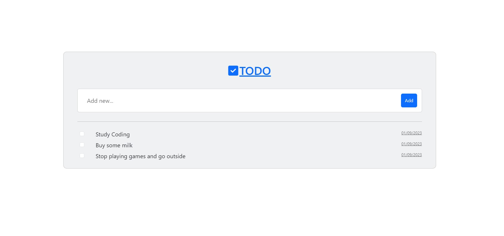

# 📝 TODO List Application

---

## 🌟 Overview

This is a Spring Boot-based TODO list application that allows you to manage your tasks effectively.



---

## 🚀 Features

- 📌 **Add New Tasks**: Easily add new tasks to your list.
- ✅ **Mark Tasks as Complete**: Swipe or click to mark tasks as done.
- 🗑️ **Delete Tasks**: Remove tasks that you no longer need.
- 👀 **View All Tasks**: See all your tasks in one place.

---

## 🛠 Technologies Used

- **Java**
- **Spring Boot**
- **Thymeleaf**
- **HTML, CSS, JavaScript**
- **Database**: MySQL

---

## 📂 Project Structure

- `SpringTodoListApplication.java`: Main Spring Boot application file.
- `Config.java`: Configuration file for the Spring application.
- `MainContoller.java`: Main controller for handling HTTP requests.
- `TodoElement.java`: Entity class for the TODO elements.
- `TodoElementRepo.java`: Repository interface for the TODO elements.
- `TodoElementService.java`: Service class for managing TODO elements.
- `application.properties`: Spring Boot application properties.

---

## 🗄 Database Configuration

This project uses MySQL for database management.

🔐 **Login Credentials**:

- **Username**: `root`
- **Password**: None (No password)
- **Database Name**: `TODOList`

---

## 🚀 How to Run

1️⃣ **Clone the repository**
\```bash
git clone https://github.com/Zephir0g/TODO-list.git
\```

2️⃣ **Navigate to the project directory**
\```bash
cd TODO-list
\```

3️⃣ **Run the application**
\```bash
./gradlew bootRun
\```

---
